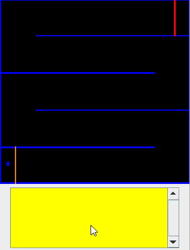
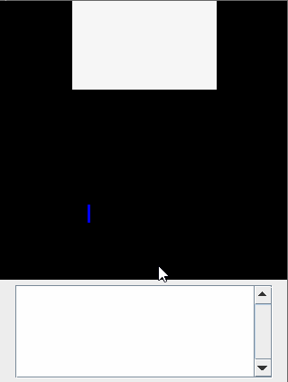
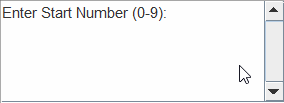
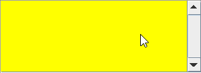

# LC3 Assembly Programs

## diamond.asm
A maze game with collision detection and timer. The diamond color can be changed by pressing r, g, b, y, or space. 

***

## rain.asm
A rain cloud with looping raindrops. The color of the drops can be changed with r, g, b, y, and space. The screen can be cleared by pressing enter.  

***

## add5.asm
Adds five 1 digit numbers entered by the user and displays the sum.

***

## countOnes.asm
Counts the numbers of ones in the binary form of the entered ASCII character.

a: 01100001  
r: 01110010  
s: 01110011  

